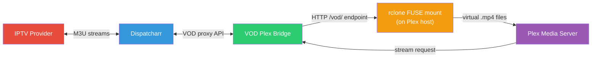
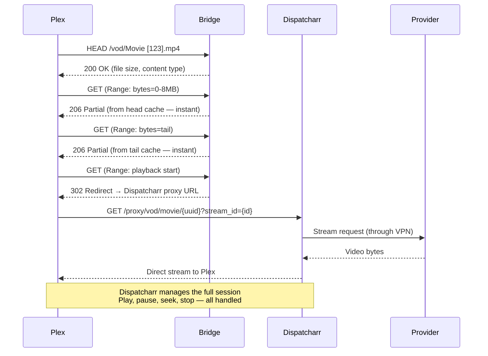
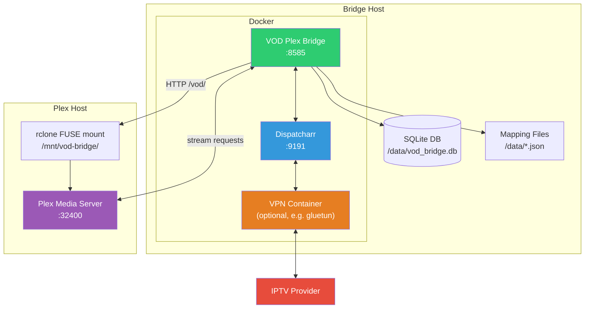
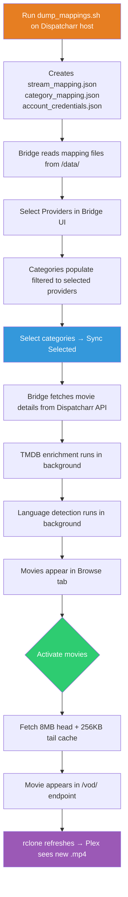

# VOD Plex Bridge

A self-hosted Docker application that bridges Video On Demand (VOD) content from [Dispatcharr](https://github.com/Dispatcharr/Dispatcharr) into [Plex Media Server](https://www.plex.tv/). Browse, activate, and stream VOD movies directly through the Plex interface — no manual file management required.

<!-- TODO: Add screenshot of the bridge UI here -->
<!--  -->

## How It Works

The bridge sits between Dispatcharr and Plex. It reads your VOD catalog from Dispatcharr, lets you pick which movies you want in Plex, and handles all the streaming plumbing automatically.



**Key points:**
- The bridge **never** connects directly to your IPTV provider — all traffic flows through Dispatcharr
- However Dispatcharr routes its traffic (VPN, direct, etc.), the bridge inherits that routing
- The bridge serves activated movies as virtual `.mp4` files via an HTTP endpoint (`/vod/`)
- **rclone** on the Plex host mounts this endpoint as a FUSE filesystem — Plex sees a normal directory of movie files
- No shared storage (NFS/CIFS) is required between the bridge and Plex — rclone handles it over HTTP

## Features

- **VOD Catalog Browser** — Browse and search your provider's movie catalog with multi-select filters for language, category, and provider
- **One-Click Activation** — Activate movies to instantly add them to your Plex library with poster art, genres, and metadata
- **Two Streaming Modes** — Choose between **Redirect mode** (302 to Dispatcharr — simpler, recommended) or **Pipe mode** (bridge proxies bytes with throttling — legacy)
- **Head/Tail Caching** — Caches the first 8 MB and last 256 KB of each activated movie so Plex can probe metadata without opening a provider connection
- **TMDB Enrichment** — Automatically fills in genres, descriptions, posters, runtime, director, country, and cast from [The Movie Database](https://www.themoviedb.org/)
- **Multi-Provider Support** — Works with multiple M3U accounts, shows which providers carry each movie
- **Language Detection** — Background detection of audio language via TMDB, with filters in the browse UI
- **Plex Now Playing Dashboard** — Real-time view of all Plex sessions (bridge content and local/live TV) with codec, resolution, bandwidth, and transcode details
- **Health Dashboard** — Real-time status of Bridge, Dispatcharr, and Plex with response times
- **Scheduled Refresh** — Configurable auto-refresh cycle (4h / 6h / 8h / 12h) keeps your catalog current
- **Dead Movie Tracking** — Automatically detects and removes movies no longer available from your provider
- **Persistent Buffers** — In pipe mode, downloaded data stays on disk between play sessions for resume
- **Activation Gating** — Only activated movies are visible to Plex. No mass scanning of your provider's catalog.

## Streaming Modes

### Redirect Mode (Default — Recommended)



In redirect mode, the bridge handles metadata probing from cache and then hands off actual playback to Dispatcharr with a 302 redirect. Dispatcharr manages the streaming connection directly with Plex — no bytes flow through the bridge during playback. This is simpler, more reliable, and eliminates pipe/throttle/buffer complexity.

### Pipe Mode (Legacy)

Set `REDIRECT_MODE=false` to use the original pipe-based approach where the bridge proxies every byte with adaptive bitrate throttling and disk buffering. This mode is retained as a fallback.

## Architecture Overview



> **Note:** Dispatcharr and the bridge can run on the same host or different hosts. Plex can be anywhere on your network. The only requirements are: the bridge can reach Dispatcharr and Plex over the LAN, and the Plex host can reach the bridge's HTTP port (default 8585) for the rclone mount.

## Catalog Sync Flow



## Requirements

Before you start, you'll need:

| Requirement | Why | Notes |
|-------------|-----|-------|
| **[Dispatcharr](https://github.com/Dispatcharr/Dispatcharr)** | Manages your M3U accounts and proxies VOD streams | Must be running and accessible from the bridge |
| **[Plex Media Server](https://www.plex.tv/)** | Plays the movies | Must be able to reach the bridge over your LAN |
| **Docker + Docker Compose** | Runs the bridge | v20+ recommended |
| **Shell access to Dispatcharr host** | Run the dump script to extract mapping data | SSH or direct terminal |
| **[rclone](https://rclone.org/)** | Mounts the bridge's HTTP endpoint as a local directory on the Plex host | Install on the **Plex host**, not the bridge |
| **FUSE** | Required by rclone for filesystem mounting | `apt install fuse3` on the Plex host |
| **TMDB API key** *(optional)* | Enriches metadata (posters, genres, descriptions) | Free at [themoviedb.org](https://www.themoviedb.org/settings/api) |

## Quick Start

See **[INSTALL.md](INSTALL.md)** for the full step-by-step guide with explanations.

```bash
# 1. Clone and configure
git clone https://github.com/knmplace/vod-plex-bridge.git
cd vod-plex-bridge
cp .env.example .env          # Edit with your IPs, tokens, paths
cp docker-compose.example.yml docker-compose.yml

# 2. Build and start
docker compose up -d --build

# 3. Run the dump script on your Dispatcharr host
DISPATCHARR_CONTAINER=your-container-name \
BRIDGE_DATA_DIR=/path/to/bridge/data \
bash setup/dump_mappings.sh

# 4. Set up rclone on the Plex host (see INSTALL.md Step 7 for full details)
#    On the Plex server:
apt install rclone fuse3
mkdir -p /root/.config/rclone
cat > /root/.config/rclone/rclone.conf << EOF
[vodbridge]
type = http
url = http://BRIDGE_IP:8585/vod/
EOF
rclone mount vodbridge: /mnt/vod-bridge --allow-other --dir-cache-time 1m \
  --vfs-cache-mode full --vfs-cache-max-age 10m &

# 5. Add /mnt/vod-bridge as a Movies library in Plex

# 6. Open http://your-bridge-ip:8585 and start browsing!
```

## AI-Assisted Setup

If you use an AI coding assistant (Claude, ChatGPT, etc.), the repo includes **[BUILD_SOP.md](BUILD_SOP.md)** — a setup guide written to be dropped into an AI chat session. It walks through the same deployment steps in an interactive, question-and-answer format: the AI asks about your network layout, Dispatcharr location, Plex configuration, etc., and tailors the commands to your environment.

This guide was built from the steps the development team used to get the application running. It's provided as-is to help you get started — no guarantees that it covers every edge case or environment, but it can save time and help you avoid common pitfalls. If you run into issues, the [Troubleshooting](#troubleshooting) section and [INSTALL.md](INSTALL.md) are your best references.

## File Structure

```
vod-plex-bridge/
├── app/                      # Application source
│   ├── main.py               # FastAPI app, version, lifespan
│   ├── api.py                # REST API (catalog, activation, filters, settings)
│   ├── proxy.py              # Stream proxy (redirect mode, pipes, range requests)
│   ├── scraper.py            # Catalog sync from Dispatcharr API
│   ├── generator.py          # .strm / .nfo file generation
│   ├── database.py           # SQLite (WAL mode, singleton connection)
│   ├── stream_mapper.py      # Movie → provider stream ID mapping
│   ├── health.py             # Health check system
│   ├── config.py             # Environment variable config
│   └── templates/
│       └── index.html        # Single-page UI
├── setup/
│   └── dump_mappings.sh      # Dispatcharr data extraction script
├── Dockerfile
├── docker-compose.example.yml
├── .env.example
├── entrypoint.sh             # TZ configuration at startup
├── requirements.txt
├── INSTALL.md                # Detailed installation guide
├── BUILD_SOP.md              # AI-assisted setup guide
└── README.md
```

## Configuration Reference

All configuration is done through environment variables in `.env`:

| Variable | Required | Default | Description |
|----------|----------|---------|-------------|
| `DISPATCHARR_URL` | Yes | `http://localhost:9191` | Dispatcharr URL reachable from the bridge container |
| `PLEX_URL` | Yes | — | Plex server URL (e.g., `http://192.168.x.x:32400`) |
| `PLEX_TOKEN` | Yes | — | Plex authentication token |
| `PLEX_LIBRARY_ID` | Yes | `7` | Plex library section ID for VOD movies |
| `BRIDGE_HOST` | Yes | `0.0.0.0` | LAN IP of the bridge host (used in .strm URLs so Plex can reach the bridge) |
| `BRIDGE_PORT` | No | `8585` | Port the bridge listens on |
| `REDIRECT_MODE` | No | `true` | `true` = 302 redirect to Dispatcharr for playback (recommended). `false` = bridge proxies bytes via pipe mode (legacy) |
| `TZ` | No | `UTC` | Container timezone (e.g., `America/New_York`) |
| `TMDB_API_KEY` | No | — | TMDB API key for metadata enrichment |
| `TMDB_READ_TOKEN` | No | — | TMDB v4 read access token (alternative to API key) |
| `DISPATCHARR_API_KEY` | No | — | Dispatcharr API key (used for VPN IP display) |
| `DATA_DIR` | No | `./data` | Host path for database and mapping files |
| `PLEX_VOD_DIR` | No | `./plex-vod` | Host path for internal .strm/.nfo storage (Plex reads via rclone, not this path directly) |

## Updating

```bash
cd vod-plex-bridge
git pull
docker compose up -d --build
```

Your database and settings persist in the `DATA_DIR` volume. Re-run `setup/dump_mappings.sh` on the Dispatcharr host if your M3U accounts have changed.

## Troubleshooting

| Problem | Check |
|---------|-------|
| Bridge can't reach Dispatcharr | Verify `DISPATCHARR_URL` — use the LAN IP, not `localhost` (unless using `network_mode: host`) |
| Plex can't play movies | `BRIDGE_HOST` must be the LAN IP (not `0.0.0.0`). Verify rclone mount is active: `ls /mnt/vod-bridge/` on the Plex host |
| Plex plays briefly then stops (redirect mode) | Ensure `DISPATCHARR_URL` uses the LAN IP reachable by Plex (not `localhost`). The 302 redirect sends Plex directly to Dispatcharr. |
| Movies in bridge but not Plex | Check rclone mount shows `.mp4` files (`ls /mnt/vod-bridge/`). Scan the library in Plex. Verify Plex library points to the rclone mount path |
| rclone mount is empty | No activated movies in the bridge, or bridge is unreachable. Test: `curl http://BRIDGE_IP:8585/vod/` |
| rclone mount hangs | Bridge is down. Check `docker ps` and `curl http://BRIDGE_IP:8585/version` from the Plex host |
| 0 categories showing | Run `setup/dump_mappings.sh` on the Dispatcharr host first. Select at least one provider. |
| Stream stops after ~10 min (pipe mode) | Switch to redirect mode (`REDIRECT_MODE=true`). If using pipe mode, check Dispatcharr nginx has `uwsgi_buffering off` on `/proxy/` |
| "Database is locked" | Should not occur in v0.27.1+. Restart the container if it does. |

## License

MIT
